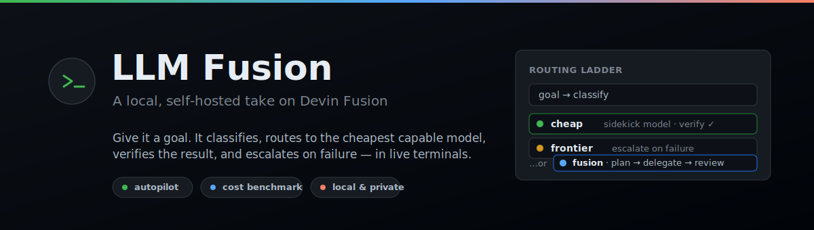
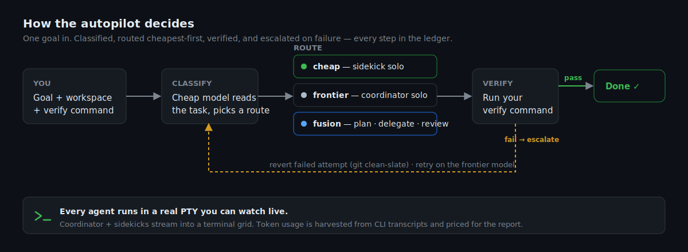

<p align="center">
  
</p>

<p align="center">
  <a href="#quickstart"></a>
  
  = 20">
  
  
</p>

**LLM Fusion** is a local, self-hosted take on [Devin Fusion](https://cognition.com/blog/devin-fusion): a smart coordinator LLM CLI delegates work to cheaper sidekick agents so you get frontier-quality output without paying frontier prices for every task.

You describe a goal. The **autopilot** classifies it, routes it to the cheapest capable model, runs the agent in a real terminal, verifies the result against a command you provide, and **escalates to a stronger model only when verification fails**. Every decision is recorded, and a built-in benchmark lets you measure whether the routing actually saves money on your own tasks.

It drives the CLI agents you already have — [Claude Code](https://www.claude.com/product/claude-code) and [Codex](https://openai.com/codex/) — in live PTY sessions. Nothing leaves your machine.

---

## Why

Frontier models are the safe default, but most engineering work — mechanical edits, running slow test suites, broad searches — doesn't need one. Paying Opus rates to rename a function is waste. Fusion's bet, [measured by Cognition](https://cognition.com/blog/devin-fusion), is that a smart coordinator delegating to cheaper models keeps quality while cutting cost. This project lets you run that pattern locally, watch it work, and **benchmark it against your own tasks** instead of taking the claim on faith.

## What it does

- **Autopilot routing** — a goal is classified `cheap` / `frontier` / `fusion`, then run cheapest-first with automatic escalation on verification failure. Force a route or let it decide.
- **Live terminals** — the coordinator and sidekick agents run in real PTYs you can watch, driven by your installed Claude / Codex CLIs.
- **Objective verification** — pass a verify command (`npm test`, a script, anything with an exit code). The harness only calls a job done when it passes, and reverts a failed attempt on a clean git slate before escalating.
- **Real cost accounting** — token usage is harvested from the CLI transcripts and priced with live [OpenRouter](https://openrouter.ai) rates. No estimates.
- **Built-in benchmark** — a three-arm harness (cheap solo vs frontier solo vs fusion) over scenario fixtures, so you can prove or disprove the savings for a class of task.
- **Copilot-style UI** — a task home, an expandable job history grouped by project, a terminal grid, and an on-demand metrics report with a Markdown export.

<p align="center">
  
</p>

## Quickstart

**Prerequisites**

- **Node.js ≥ 20**
- A C/C++ toolchain for the one native dependency ([`node-pty`](https://github.com/microsoft/node-pty)). Prebuilt binaries cover most setups; if `npm install` needs to compile: `build-essential` + `python3` on Linux, Xcode Command Line Tools on macOS, or the Windows Build Tools on Windows.
- At least one agent CLI on your `PATH` — [`claude`](https://www.claude.com/product/claude-code) and/or [`codex`](https://openai.com/codex/), already authenticated.

**Run**

```bash
npm install
npm run build
npm start
```

Open **http://127.0.0.1:4174**, type a goal, and start a task. The default port is `4174`; override with `PORT`.

**Develop**

```bash
npm run dev     # tsx watch, no build step
npm test        # full suite
```

## Using it

1. **Home** — describe a goal, pick a workspace with the folder browser, optionally add a verify command, choose a route (or **Auto**), and start. Watch the job move through classify → run → verify in its timeline.
2. **Terminals** — the full mission-control view. Launch a coordinator + sidekicks, start a mission, and see delegations route themselves through the ledger.
3. **Report** — generate on demand for totals, per-route and per-project breakdowns, real token cost, and a Markdown download.

## Benchmark

The `bench/` harness answers the core question with numbers. Each scenario runs three arms with an identical prompt — `coordinator-solo`, `sidekick-solo`, and `fusion` — and grades results [FrontierCode](https://cognition.com/blog/frontier-code)-style: blocker checks gate mergeability, weighted rubric items score quality, and failing a blocker zeroes the score.

```bash
node bench/run.mjs list                       # scenarios
node bench/run.mjs prices                      # refresh OpenRouter rates
node bench/run.mjs seed s1 fusion              # prints a workspace + prompt
#   run the agent against that workspace, then:
node bench/run.mjs score bench/runs/<runDir>   # pass/fail, quality, real cost
node bench/run.mjs report                      # aggregate to bench/RESULTS.md
```

See [bench/README.md](bench/README.md) for the full protocol and the scenario taxonomy (mechanical, test-heavy, judgment-trap, and more).

## Security & trust model

LLM Fusion runs agents with **edit and shell permissions** and spawns them for you. Anyone who can reach the API can execute commands as your user. The server binds **loopback (`127.0.0.1`) by default**; exposing it needs an explicit opt-in and is your responsibility to secure. Point the autopilot only at code you trust. Read [SECURITY.md](SECURITY.md) before running it anywhere unusual.

## How it works

- **Server** ([`src/server`](src/server)) — an Express + WebSocket app owns PTY sessions, the autopilot state machine, JSON/JSONL persistence, and the routing ledger.
- **Client** ([`src/client`](src/client)) — a Vite + [xterm.js](https://xtermjs.org) frontend: the task home, terminal grid, and report.
- **Autopilot** ([`src/server/autopilot.ts`](src/server/autopilot.ts)) — classify → route → run headless or in a visible PTY → verify → escalate, passing goals via files (never shell args) so quoting can't break or inject.
- **Persistence** — runtime state lives under `data/` (git-ignored): session logs, job records, and the append-only ledger.

## License

[MIT](LICENSE).

<sub>Not affiliated with Cognition or Devin. "Devin Fusion" is referenced as prior art for the approach this project explores locally.</sub>
